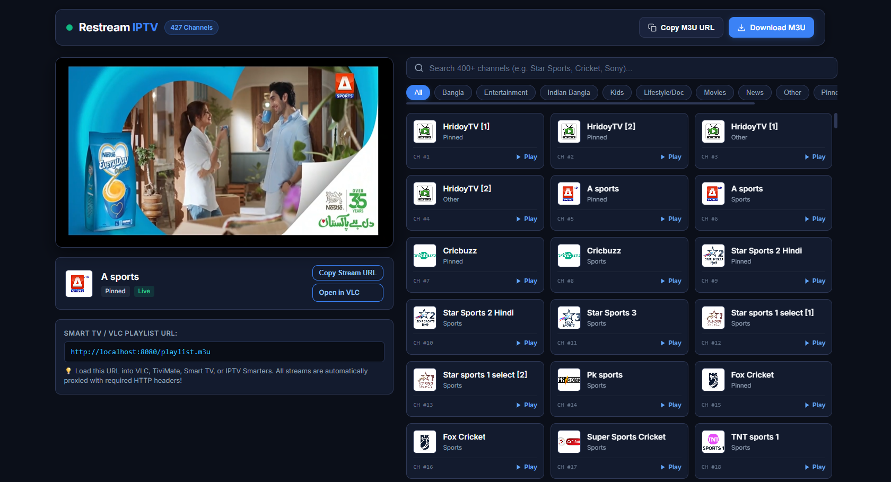

# 📺 IPTV Restream Proxy & Web Player

<p align="center">
  
  
  
  <a href="https://hits.seeyoufarm.com"></a>
  
</p>

<p align="center">
  
</p>


A high-performance, zero-dependency streaming bridge and local IPTV proxy server designed for Cloudflare-protected M3U playlists with custom header requirements (`User-Agent`, `Referer`, `Origin`).

---

## ⚡ The Problem & The Solution

| The Problem | How This Tool Solves It |
|---|---|
| Streams require strict HTTP headers (`Referer`, `User-Agent`, `Origin`). | The proxy fetches upstream streams injecting all required headers automatically. |
| Media players (VLC, Smart TVs, Android TV) drop headers on sub-manifests and `.ts` video chunks, causing **HTTP 403 Forbidden**. | Manifests are rewritten on the fly so all segment requests route through the proxy cleanly. |
| Web browsers block `.m3u8` streams due to **CORS** restrictions. | The proxy serves video with full `Access-Control-Allow-Origin: *` headers for in-browser playback. |

---

## 🚀 Quick Start

### 🪟 Windows
- **Option 1 (One-click Web Player)**: Double-click `start_server.bat`
- **Option 2 (Interactive CLI Menu)**: Double-click `start_menu.bat`
- **Option 3 (Terminal)**:
  ```powershell
  python run_server.py
  ```

### 🐧 Ubuntu / Debian (VPS or Server)
Run the automated installer:
```bash
chmod +x install.sh
./install.sh
```
*This installs dependencies, configures the firewall, and enables a 24/7 background systemd service.*

---

## 🌐 URLs & Access Endpoints

Once the server is running on port `8080`:

| Resource | URL |
|---|---|
| **Web Player Dashboard** | `http://localhost:8080/` |
| **All Channels M3U Playlist** | `http://<SERVER_IP>:8080/playlist.m3u` |
| **Sports Only M3U Playlist** | `http://<SERVER_IP>:8080/playlist.m3u?group=Sports` |
| **Single Channel Stream** | `http://<SERVER_IP>:8080/channel/<ID>.m3u8` |
| **JSON Channels API** | `http://<SERVER_IP>:8080/api/channels` |
| **Health Check** | `http://<SERVER_IP>:8080/health` |

---

## 📱 How to Use with Players

### 1. VLC Media Player (PC / Mac / Mobile)
1. Open VLC and press `Ctrl + N` (or **Media** -> **Open Network Stream**).
2. Enter your M3U URL:
   ```
   http://<YOUR_IP>:8080/playlist.m3u
   ```
3. Click **Play**. All 420+ channels will load with logos and metadata.

### 2. Smart TV / FireStick (TiviMate, IPTV Smarters, OTT Navigator)
1. Ensure your TV is on the same local network as the server (or use your VPS public IP).
2. In your IPTV app, choose **Add Playlist via M3U URL**.
3. Enter:
   ```
   http://<YOUR_IP>:8080/playlist.m3u
   ```

---

## 🔴 RTMP Re-streaming (YouTube, Facebook, Twitch)

Re-broadcast any channel to live platforms using FFmpeg:

```bash
python rtmp_streamer.py <channel_id> <rtmp_destination_url>
```

#### Examples:
- **YouTube Live**:
  ```bash
  python rtmp_streamer.py 5 rtmp://a.rtmp.youtube.com/live2/<YOUR_STREAM_KEY>
  ```
- **Facebook Live**:
  ```bash
  python rtmp_streamer.py 5 "rtmps://live-api-s.facebook.com:443/rtmp/<YOUR_STREAM_KEY>"
  ```
- **Twitch**:
  ```bash
  python rtmp_streamer.py 5 rtmp://live.twitch.tv/app/<YOUR_STREAM_KEY>
  ```

---

## 📂 Project Structure

```text
Restream/
├── run_server.py        # Direct server launcher
├── main.py              # Interactive console dashboard
├── restream_proxy.py    # Core HTTP streaming engine & HLS rewriter
├── playlist_manager.py  # M3U parser, channel query & caching
├── rtmp_streamer.py     # FFmpeg RTMP live re-broadcaster
├── start_server.bat     # Windows 1-click server runner
├── start_menu.bat       # Windows 1-click CLI menu
├── install.sh           # Ubuntu 1-click installer & systemd service
├── static/              # Dark-mode Web Player (HTML, CSS, JS)
│   ├── index.html
│   ├── style.css
│   └── app.js
├── README.md            # User manual & documentation
└── requirements.txt     # Dependency information (Zero required!)
```

---

## ⚙️ Service Commands on Ubuntu

| Task | Command |
|---|---|
| View live logs | `sudo journalctl -u restream -f` |
| Check service status | `sudo systemctl status restream` |
| Restart server | `sudo systemctl restart restream` |
| Stop server | `sudo systemctl stop restream` |
